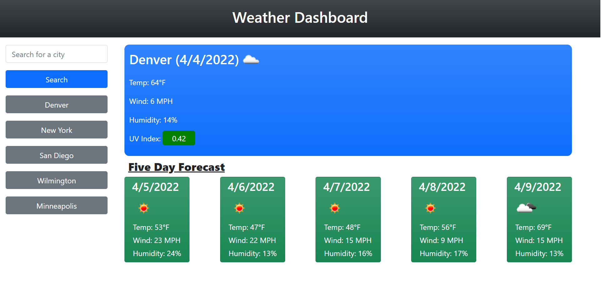

# City-Weather-Dashboard-API

## Introduction 
The weather on a daily basis can impact our lives. Whether it's your commute or your plans for the day or something to talk about, the outdoor elements has always been a topic of conversation in any area. 

With this weather dashboard, you will be able to look up any city you would like and have the current weather for that city with a 5-day forecast outlook as well to plan ahead for your days. The weather dashboard includes the temperature, wind speed, humidity and a uv index. Every time you search for a city, your city will be saved in your local storage and displayed as a button whenever you would like to come back. 

## Technologies 
HTML, CSS, Bootsrap, Javascript, JQuery, Moment.js., openweathermap API

## Features

### Weather icons
Get a visual repesentation of what the weather is out for the current weather and the 5-day outlook. You'll see if it is going to be sunny, partly cloudy, overcast, rainning, thunderstorms, and more with the help from the openweather map API. 

### UV Index color scheme
Don't know if the uv index number is good or bad? This weather dashboard features the uv index box color coding for the uv index. Green box meaning for a healthy index score, yellow is moderate, and red is a high uv index

## Screenshot
Here is a full screenshot of what the web application looks and what you are able to do with this dashboard. 

## Links
Here is the link to get to the website
[https://midth002.github.io/city-weather-dashboard-API/](https://midth002.github.io/city-weather-dashboard-API/)
